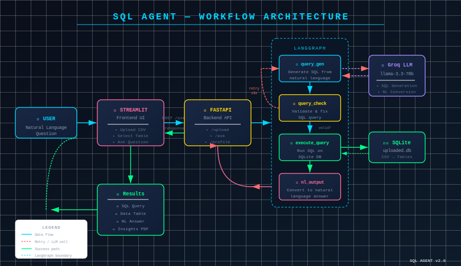

# 🤖 SQL Agent — AI-Powered Natural Language to SQL

<p align="center">
  
  
  
  
  
  
</p>

<p align="center">
  A full-stack AI agent that converts natural language questions into SQL queries, executes them on uploaded CSV datasets, and returns human-readable answers — powered by Groq's LLaMA 3.3 70B and LangGraph.
</p>

---

## 🎬 Demo

> Upload a CSV → Select a table → Ask a question in plain English → Get SQL + Results + Answer

**Live App:** [Streamlit Cloud](https://aisqlagent.streamlit.app/)  
**Backend API:** [Render](https://sql-agent-backend-600y.onrender.com/docs)

---

## 🗺️ Workflow Architecture



### How it works:
1. **User** uploads a CSV and asks a natural language question via Streamlit
2. **FastAPI** receives the request and invokes the LangGraph workflow
3. **LangGraph** orchestrates 4 nodes:
   - `query_gen` → Groq LLM generates SQL from the question
   - `query_check` → validates and fixes the SQL
   - `execute_query` → runs SQL on SQLite database
   - `nl_output` → Groq LLM converts results to natural language
4. Results (SQL + table + answer) returned to the frontend

---

## ✨ Features

| Feature | Description |
|---|---|
| 📂 **CSV Upload** | Upload any CSV with a unique table name |
| 🗂️ **Table Management** | View schema and delete tables |
| 💬 **Natural Language Queries** | Ask questions in plain English |
| 🧠 **SQL Generation** | LLM generates accurate SQLite queries |
| ✅ **SQL Validation** | Queries validated before execution |
| 📊 **Results Table** | Clean HTML table display (no pyarrow) |
| 💡 **NL Answer** | Human-readable summary of results |
| 📈 **Dataset Insights** | Full profiling report (downloadable HTML) |
| 🗑️ **Delete Tables** | Remove uploaded datasets anytime |
| 🔒 **Read-Only** | INSERT/UPDATE/DELETE/DROP blocked at 3 levels |
| 🐳 **Docker Ready** | Single container with Supervisor |

---

## 🏗️ Project Structure

```
sql_agent/
├── backend/
│   ├── __init__.py
│   ├── app.py          # FastAPI endpoints
│   ├── config.py       # Groq LLM setup
│   ├── database.py     # SQLite operations
│   ├── nodes.py        # LangGraph nodes + State TypedDict
│   ├── utils.py        # CSV → SQLite
│   └── workflow.py     # LangGraph state graph
├── frontend/
│   ├── frontend.py     # Streamlit UI
│   └── .streamlit/
│       └── secrets.toml
├── Dockerfile
├── docker-compose.yml
├── supervisord.conf
├── .dockerignore
├── .env.example
├── requirements.txt
└── README.md
```

---

## 🚀 Getting Started

### Prerequisites
- Python 3.11+
- [Groq API Key](https://console.groq.com/keys) (free)
- Docker (optional)

---

### Option 1 — Run Locally

**1. Clone the repo**
```bash
git clone https://github.com/Devamsingh09/sql_agent.git
cd sql_agent
```

**2. Create virtual environment**
```bash
python -m venv venv

# Windows
venv\Scripts\activate

# macOS/Linux
source venv/bin/activate
```

**3. Install dependencies**
```bash
pip install -r requirements.txt
```

**4. Set up environment variables**
```bash
cp .env.example .env
# Edit .env and add your GROQ_API_KEY
```

**5. Run backend** (Terminal 1)
```bash
uvicorn backend.app:app --reload
# Running at http://127.0.0.1:8000
```

**6. Run frontend** (Terminal 2)
```bash
cd frontend
streamlit run frontend.py
# Running at http://localhost:8501
```

---

### Option 2 — Run with Docker

**1. Set up environment**
```bash
cp .env.example .env
# Add your GROQ_API_KEY to .env
```

**2. Build and run**
```bash
docker-compose up --build
```

**3. Open in browser**
- Frontend → http://localhost:8501
- API Docs → http://localhost:8000/docs

---

## 🔌 API Endpoints

| Method | Endpoint | Description |
|---|---|---|
| `GET` | `/` | Health check |
| `POST` | `/upload` | Upload CSV as SQLite table |
| `GET` | `/tables` | List all uploaded tables |
| `GET` | `/schema` | Full database schema |
| `GET` | `/schema/{table}` | Schema for specific table |
| `POST` | `/ask` | Ask natural language question |
| `GET` | `/profile/{table}` | Download profiling report |
| `DELETE` | `/table/{table}` | Delete a table |

---

## 🧪 Example Questions

Once you upload `bank_transactions.csv`:

```
How many total transactions are there?
What is the total amount spent across all transactions?
Show all failed transactions
Who are the top 5 spenders overall?
Which category has the highest total spending?
How many transactions happened per month?
What is the total amount spent per bank?
Show all UPI transactions above 5000
```

---

## 🔒 Security

The agent is **read-only** — write operations are blocked at 3 levels:

1. **LLM Prompt** — instructed to generate only `SELECT` statements
2. **Validator Node** — rejects any `INSERT/UPDATE/DELETE/DROP/ALTER`
3. **Retry Logic** — forbidden queries trigger regeneration (max 3 retries)

---

## 🛠️ Tech Stack

| Layer | Technology |
|---|---|
| **LLM** | Groq — LLaMA 3.3 70B Versatile |
| **Orchestration** | LangGraph (State Graph) |
| **Backend** | FastAPI + Uvicorn |
| **Frontend** | Streamlit |
| **Database** | SQLite |
| **Profiling** | ydata-profiling |
| **Container** | Docker + Supervisor |
| **Deployment** | Render (backend) + Streamlit Cloud (frontend) |

---

## ☁️ Deployment

### Backend → Render
- Runtime: Python 3.11
- Build Command: `pip install -r requirements.txt`
- Start Command: `uvicorn backend.app:app --host 0.0.0.0 --port $PORT`
- Environment Variables: `GROQ_API_KEY`, `DB_PATH=/tmp/uploaded.db`

### Frontend → Streamlit Cloud
- Main file: `frontend/frontend.py`
- Secret: `BACKEND_URL = "https://your-render-url.onrender.com"`

---

## 👨‍💻 Author

**Devam Singh**  
[GitHub](https://github.com/Devamsingh09)

---

## 📄 License

MIT License — feel free to use and modify.
